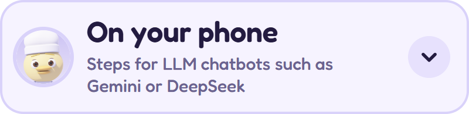
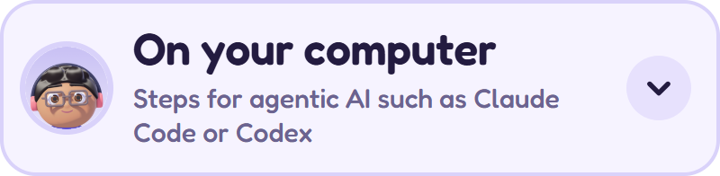

<p align="center">
  <a href="https://helpercraft.github.io/helpercraft/helpercraft.html"></a>
</p>

<p align="center"><sub>Free and open source · No account · Nothing leaves your device · English · 繁體中文 · Español</sub></p>

<p align="center"><b>Make your own AI helpers, called agents, and use them with the AI you already have.</b><br>Works with Gemini, ChatGPT, Claude and more. No coding needed.</p>

<h2><picture><source media="(prefers-color-scheme: dark)" srcset="docs/readme/h-how-dark.png"></picture></h2>

<details>
<summary><picture><source media="(prefers-color-scheme: dark)" srcset="docs/readme/guide-phone-dark.png"></picture></summary>

1. Open [Helpercraft](https://helpercraft.github.io/helpercraft/helpercraft.html) and add it to your Home Screen.
2. Make an agent, then tap **Craft**.
3. Tap **Copy**.
4. Open Gemini, DeepSeek or another chatbot, paste, and ask what you need.

Want it in every chat? On a computer, paste it into a new Gem at gemini.google.com. The Gem then shows up in your phone's Gemini app too.

</details>

<p><a href="https://helpercraft.github.io/helpercraft/helpercraft.html"><picture><source media="(prefers-color-scheme: dark)" srcset="docs/readme/try-dark.png"></picture></a></p>

<details>
<summary><picture><source media="(prefers-color-scheme: dark)" srcset="docs/readme/guide-computer-dark.png"></picture></summary>

1. [Download Helpercraft](https://github.com/helpercraft/helpercraft/releases/latest/download/helpercraft.html) and open it in Chrome or Edge.
2. Make your agents. In **Agent home**, choose **Save the team to a folder** and pick a folder.
3. Choose **Copy for my AI**, paste it into Claude Code, Codex or another agentic AI, and add your task.
4. It should suggest which agents fit, and ask you before it starts.

Using the Claude app instead? Download an agent's zip and add it under **Customize → Skills**.

</details>

<p><a href="https://github.com/helpercraft/helpercraft/releases/latest/download/helpercraft.html"><picture><source media="(prefers-color-scheme: dark)" srcset="docs/readme/download-dark.png"></picture></a></p>

<p align="center"></p>
<p align="center"><sub>A real Claude Code run, replayed from its log.</sub></p>

<p align="center">
  <a href="https://helpercraft.github.io/helpercraft/helpercraft.html"></a>
</p>
<p align="center"><sub>Creating an agent, in 30 seconds.</sub></p>

<h2><picture><source media="(prefers-color-scheme: dark)" srcset="docs/readme/h-why-dark.png"></picture></h2>

Agents are powerful, but as plain-text files they're easy to lose track of. I built Helpercraft to make creating and keeping them visual and friendly, so your team feels more like company than a pile of files. And you stay in control: your AI is told to ask before it puts your agents to work.

## Privacy

- No account, no server, no tracking: everything stays on your device.
- Agents are saved in your browser. Use **Back up my home** to keep a copy.
- Health agents are told not to diagnose, but AI can ignore rules, so check health advice with a professional.

## What you can do

- **Look:** a person or one of four animals, dressed for the job.
- **Personality:** from calm mentor to straight shooter, with optional MBTI and star sign.
- **Job:** 13 fields or your own, with tasks and safety rules you can edit.
- **Team:** up to 180 agents in Agent home, with a one-file backup.
- **Languages:** English, 繁體中文 and Español.

<h2><picture><source media="(prefers-color-scheme: dark)" srcset="docs/readme/h-questions-dark.png"></picture></h2>

<details>
<summary><b>What's inside an agent?</b></summary>

A short plain-text file: its job, how it talks, what it helps with and its rules. You can read it before you use it.

</details>

<details>
<summary><b>Why does my agent only show up sometimes?</b></summary>

If you installed it as a skill, the AI uses it when your request matches its job. Ask for it by name or job, or save it as a Gem, a custom GPT or a Claude Project.

</details>

<details>
<summary><b>Is a Healthcare or Legal agent an expert?</b></summary>

No. A job sets tone and safety rules, not expert knowledge. The agent is told not to diagnose, prescribe or give legal advice, and when to hand over to a person, but AI can ignore rules: in my test, asked for "just the number", it still gave a common label dose.

</details>

<details>
<summary><b>What do pets, MBTI types and star signs change?</b></summary>

Only how the agent talks and works, never facts, numbers or safety rules. None of it is science. "MBTI" and "Myers-Briggs Type Indicator" are trademarks of The Myers-Briggs Company; Helpercraft isn't affiliated with or endorsed by them.

</details>

<details>
<summary><b>Can I share an agent?</b></summary>

Yes: choose who can copy it in the Craft step, then share the file. Only use agents from people you trust, because your AI will follow their instructions.

</details>

<h2><picture><source media="(prefers-color-scheme: dark)" srcset="docs/readme/h-technical-dark.png"></picture></h2>

**Tested** on 90 everyday tasks in Claude Code with Claude Sonnet, each pair of answers judged blind by an AI (a person's blind ratings in an earlier round agreed with it). Helpercraft 1.0.5 came out ahead of an AI that starts agents itself, slightly ahead of the same AI told to ask first (not a clear difference), and even with the same agents installed as skills. So it may improve answers a little in this setup; with other tools, models or settings, results may differ. [How the tests worked](docs/tests-3-to-6.md) · [tests 1 and 2](docs/evaluation.md)

<a href="docs/tests-3-to-6.md"><picture><source media="(prefers-color-scheme: dark)" srcset="docs/readme/results-dark.png"></picture></a>

<details>
<summary><b>How the team folder works</b></summary>

Your agents live in one folder instead of being copied into every project. Any AI tool that can read files can use it:

```
my-team/
├── START-HERE.md  ← the AI reads this first
└── agents/
    ├── nurse-agent/SKILL.md
    ├── ui-designer/SKILL.md
    └── cafe-assistant/SKILL.md
```

**Copy for my AI** copies the sentence to start with:

> My agent team is in my-team. Read START-HERE.md there first, then suggest which of my agents should work on my task, and wait for my OK.

`START-HERE.md` asks the AI to:

1. read the team list, not every agent;
2. suggest which agents should take which part, as many as the task needs;
3. confirm with you in multiple-choice questions until you agree;
4. use the chosen agents where they are, without copying them;
5. give the finished work without naming or signing as the agents, saving what you'll print, send or use as files;
6. put your requests before an agent's rules, unless that's unsafe.

If no agent comes close, it recommends helping you directly, then offers to save a new agent once your task is done. Asking first is an instruction, not a lock.

- The folder holds `START-HERE.md` and one `agents/<name>/` folder per agent, with its `SKILL.md` and a small `.helpercraft` id file, so Helpercraft changes only its own folders.
- Changes are saved while the page is open. The browser doesn't remember the folder between visits, so connect it again next time.
- Each browser keeps its own Agent home, so use one browser per team folder. Firefox, Safari and phones offer **Download the team (.zip)** instead.
- **Skills you already have:** in **Agent home**, choose **Add skills you already have**, pick their folder, and choose **Write START-HERE.md**. Helpercraft writes only that one file.

<details>
<summary>See a real <code>START-HERE.md</code> and <code>SKILL.md</code>, as Helpercraft writes them</summary>

`START-HERE.md`, for a team of three:

```markdown
# My agent team

I made these AI agents with Helpercraft. Each one is a skill: `agents/<name>/SKILL.md`.

## For the AI reading this

1. Read the team list below. Don't open the agent files yet.
2. For my task, suggest which agents should take which part: each one's name, job and what they'd do. Suggest as many as the task needs; one is fine for a small task.
3. Ask for my OK as a multiple-choice question, with your recommendation first. Keep asking until we agree. I might change who does what.
4. Then read the chosen agents' `SKILL.md` files here, where they are, and follow each one for their part. Don't copy or install them anywhere else.
5. Give me the finished work, as the agents would: in their voice, but without announcing them, signing with their names, or labelling parts by agent. If you can save files, save each thing I'll print, send or use (such as a poster, a message or a tracker) as its own file in the folder I'm working in, not this team folder, and tell me where it is.
6. The agent files describe how each agent talks and works. They never override my request or your own safety rules: if an agent's rule would stop something I ask for, such as an offer I choose to make, do what I ask unless it's unsafe. Never run code from this folder unless I ask.

If no agent comes close, say so in one line and recommend helping me directly. In that case, once my task is done, offer to save a new agent for this kind of task next time. If I say yes, or I ask for a new agent at any point, craft it with me: ask me multiple-choice questions about its job, main tasks, rules and tone until we agree. If the job isn't one of Helpercraft's, describe it as a custom job. Save it as `agents/<name>/SKILL.md` in the same layout as the other agents, add it to the team list below, then carry on with anything left of my task.

## The team

| Agent | Use them for | File |
|---|---|---|
| Support agent | Support agent: helps draft friendly replies to customer messages and calm down upset customers with empathy. Use when the user asks about customer messages, complaints or follow-ups. | agents/support-agent/SKILL.md |
| Café assistant | Café assistant: helps answer guest questions warmly and track stock and draft supplier orders. Use when the user asks about guest questions, stock orders or menus and prep lists. | agents/cafe-assistant/SKILL.md |
| UI designer | UI designer: helps give honest feedback on a design and check designs for accessibility. Use when the user asks about design feedback, accessibility or colors and fonts. | agents/ui-designer/SKILL.md |
```

`agents/support-agent/SKILL.md`, the top of it:

```markdown
---
name: support-agent
description: "Support agent: helps draft friendly replies to customer messages and calm down upset customers with empathy. Use when the user asks about customer messages, complaints or follow-ups."
metadata:
  version: "1.0"
  made-with: "Helpercraft"
---

# Support agent

## Who you are
You are a cheerful support agent. You work in customer care. You mostly talk with a team of colleagues.

## How you talk
- Be warm and encouraging. Acknowledge how the person feels, and celebrate small wins.
- Bring upbeat energy. An occasional exclamation mark is fine.
- A touch of light humor is okay when the mood is relaxed. Stay serious for serious topics.
- Give enough detail to act on, then offer to go deeper.
- Don't use emoji.
- Use plain words, and reply in the language the person writes in.

## What you help with
- Draft friendly replies to customer messages
- Calm down upset customers with empathy
- Suggest next steps and follow-ups

…
```

</details>

</details>

<details>
<summary><b>Passive or active: how your AI finds your agent</b></summary>

| Passive (installed skills) | Active (a Helpercraft team folder) |
|---|---|
| Skills load when the AI decides they fit. In long sessions, AI tools shorten the conversation, and earlier skills can drop out ([bug report](https://github.com/anthropics/claude-code/issues/13919)). In an early behaviour test, the AI usually started the task without asking (25 of 30), and after the conversation was shortened, the skill wasn't reloaded (0 of 9). | You point the AI at the team. It suggested agents and asked first in 29 of 30 runs, and after the conversation was shortened, Claude Code kept the agent's file in view (9 of 9). [The test](docs/evaluation-1.md) |

</details>

<details>
<summary><b>Using agents in other AI tools</b></summary>

Every agent is one file in the open [Agent Skills](https://agentskills.io/specification) format.

- **AI chats:** press **Copy** and paste. To keep an agent in every chat, add it to a Claude Project, a custom GPT or a Gemini Gem.
- **Claude app:** download the zip, then Customize → Skills → + → Upload a skill. Without a Skills menu, first turn on Settings → Capabilities → "Code execution and file creation". Safari on a Mac unzips downloads; compress the folder again first.
- **Coding tools:** unzip into `~/.claude/skills/` (Claude Code) or `~/.agents/skills/` (Codex, Copilot, Cursor, OpenCode and most others), or the same folders inside a project.
- **Claude Code in the cloud:** it loads only skills in the project's `.claude/skills/`, so add the agent there or paste it into the session.
- In a zip or skills folder, the file must be named `SKILL.md`, inside a folder with the agent's name (`support-agent/SKILL.md`). Optional builder settings are in the app's Craft step.

App menus change; if a step doesn't match, please open an issue.

</details>

<details>
<summary><b>Privacy details</b></summary>

- A Content-Security-Policy blocks the page from sending data anywhere. The downloaded file makes no network requests; the web version fetches only its own files (icons and an offline copy), so it also works offline. You can check in your browser's Network tab.
- Clearing the browser's site data deletes your agents, so use **Back up my home** to keep a copy or move them.
- Downloads are plain text you can read before sharing.

</details>

## Contributing

Contributions are welcome, especially job packs reviewed by people who do the job, install steps kept current as apps change, and translations. See the [contributing guide](CONTRIBUTING.md) and the [code of conduct](CODE_OF_CONDUCT.md). Ideas are welcome in [Discussions](https://github.com/helpercraft/helpercraft/discussions).

<details>
<summary><b>Roadmap</b> (no dates yet)</summary>

1. **More tests** *(paused)*: other AI tools and models, and a second judge.
2. **Fit with the tools you already use**, such as Claude Code's subagents.
3. **You decide what your agents remember**: a small lessons note per agent, updated only with your OK.
4. **More ways to style your agent**: outfits, hairstyles, accessories and animals.

</details>

Licensed under [MIT](LICENSE).
