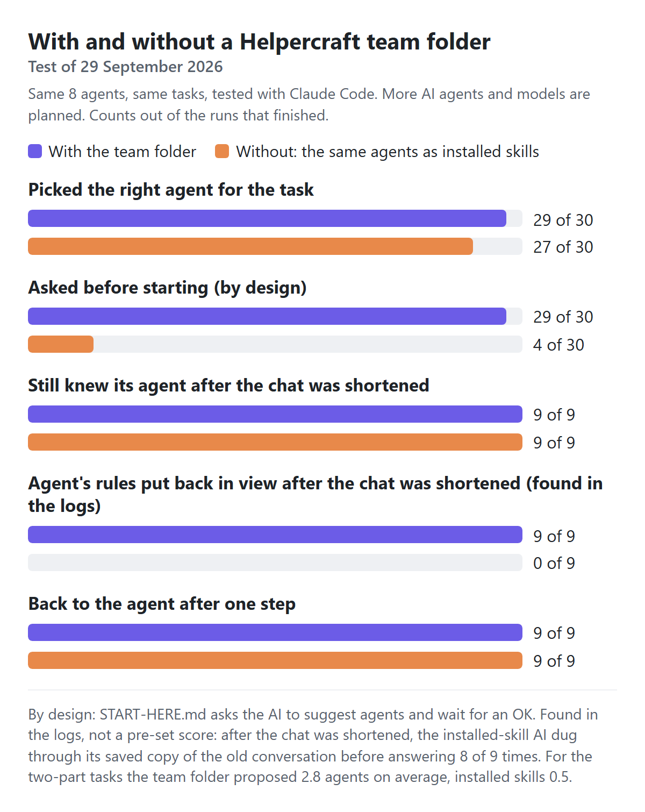

# First test: with and without a Helpercraft team folder

Tested on 29 September 2026 with Claude Code 2.1.284 (claude-opus-5-5), in a clean setup with no personal settings, plugins or add-ons.
The plan and scoring rules were written and committed before the full run: [tests/team_eval.md](../tests/team_eval.md). Three sentences in it were corrected after the run, and the plan quotes the originals.
Our second, bigger test, which also scores the answers against the AI alone, is in [evaluation.md](evaluation.md).

**About the words:** when this test ran, Helpercraft called its agents "helpers" and gave each one a name. The prompts, the files and the AI's replies quoted below use those words. On 30 September 2026 the app renamed them "agents" and made names optional. This report uses the new words, calls each test agent by its job, and shows names in quotes as [name].

<picture><source media="(prefers-color-scheme: dark)" srcset="readme/eval-dark.png"></picture>

## What we found

- **Both picked the right agent most of the time.** The team folder did in 29 of 30 runs and installed skills in 27 of 30. At this size, that difference alone means little.
- **For a bigger job, the team folder built a team.** For the two two-part tasks it proposed 2.8 agents on average; installed skills used 0.5. For the café website, installed skills used an agent in 0 of 3 runs, and the AI did the whole job itself.
- **With the team folder, you decide first.** It asked before starting in 29 of 30 runs. With installed skills, the first reply already did the task in 25 of 30. The 4 times it asked, it was about the task, such as which machine model, not about which agent to use.
- **It reads, it doesn't copy.** With the team folder, the AI read `START-HERE.md` in 30 of 30 runs, opened no agent's file before the OK (0 of 30), and afterwards read the chosen agent's file where it is (9 of 9).
- **After the conversation was squeezed, both still knew their agent, but not in the same way.** Both passed the check: 9 of 9 (team folder) and 9 of 9 (installed skills). With the team folder, the AI had opened the agent's file, and Claude Code put that file back in view right after the squeeze (9 of 9); the AI answered without looking anything up (9 of 9). An installed skill's rules came back in 0 of 9, and the AI dug through its saved copy of the old conversation before answering (8 of 9). Keeping that copy and putting opened files back are Claude Code features; other tools may not do either. (We found this in the logs while checking the results. It wasn't one of the pre-set scores.)

## What was compared

The same 8 agents (made with Helpercraft: a nurse agent, a support agent, a UI designer, a maintenance tech, a café assistant, a coding buddy, a tutor and a lab technician), used two ways:

- **Team folder (active):** the AI gets Helpercraft's "Copy for my AI" sentence and a task. `START-HERE.md` asks it to suggest who fits and wait for an OK.
- **Installed skills (passive):** the same `SKILL.md` files in Claude Code's own skills folder. The AI gets only the task and decides by itself whether to use one.

10 tasks, each run 3 times per way. Then 3 tasks where the conversation was squeezed (`/compact`, what AI tools do in long sessions) to see whether the AI still knew its agent, and whether one step brought the agent back: pasting the sentence again (team folder) or typing the skill's command (installed skills).

A pick counts as right when it includes at least one agent that fits the task and none that don't; for the Kyoto trip, right means no agent at all. Under a stricter rule, every agent that fits, the team folder scores 28 of 30 and installed skills 24 of 30.

## Results

| | Team folder | Installed skills |
|---|---|---|
| Picked the right agent | **29 of 30** | **27 of 30** |
| Asked before starting (by design, not a score) | 29 of 30 | 4 of 30 |
| Agents proposed for the two-part tasks (average) | 2.8 | 0.5 |
| Still knew its agent after the squeeze | 9 of 9 | 9 of 9 |
| … by re-reading the agent's file | 0 of 9 | 0 of 9 |
| … with the agent's rules put back in view (found in the logs) | 9 of 9 | 0 of 9 |
| … after digging through the old conversation (found in the logs) | 0 of 9 | 8 of 9 |
| Back to the agent after one step | 9 of 9 | 9 of 9 |

With the team folder, the AI read `START-HERE.md` in 30 of 30 runs and opened an agent's own file before the OK in 0. After the OK it read the chosen agent's file where it is, without copying it, in 9 of 9.
Runs that timed out or failed are left out of the counts: 0 (team folder), 0 (installed skills).

### Task by task

| Task | Team folder: right | Suggested | Installed skills: right | Used |
|---|---|---|---|---|
| Reply to a one-star review | 3 of 3 | support agent, café assistant | 3 of 3 | support agent |
| Explain a medical word | 3 of 3 | nurse agent | 3 of 3 | nurse agent |
| One-page café website (two-part) | 3 of 3 | UI designer, café assistant, coding buddy | 0 of 3 | none |
| Fix a Python KeyError | 3 of 3 | coding buddy | 3 of 3 | coding buddy |
| Espresso machine error | 3 of 3 | café assistant, maintenance tech | 3 of 3 | maintenance tech |
| Is this text contrast OK? | 3 of 3 | UI designer | 3 of 3 | UI designer |
| A child's fractions homework | 3 of 3 | tutor | 3 of 3 | tutor |
| Make a 1:50 dilution | 3 of 3 | tutor, lab technician | 3 of 3 | lab technician |
| Bake-sale menu and sign-up page (two-part) | 3 of 3 | UI designer, café assistant, coding buddy | 3 of 3 | café assistant |
| Kyoto trip (no agent fits) | 2 of 3 | tutor | 3 of 3 | none |

### What the replies looked like (café website task)

Team folder:

> I read START-HERE.md. None of your helpers is set up to build websites, so I'd write the page itself. Three of them fit parts of the job well:
>
> | Helper | Job | What they'd do |
> |---|---|---|
> | **[name]** | Café assistant | Write the wording for your menu and opening hours: dish names, short descriptions, and a warm welcome line. |
> | **[name]** | UI designer | Review the finished page for layout, colours, fonts and accessibility (readable contrast, works on phones). |
> | **[name]** | Coding buddy | *Optional.* Explain the page's code in plain words, if you'd like to edit it yourself later. |
>
> **The plan:** [name] writes the text → I build a single `index.html` file (no extra tools needed) in your working folder → [name] reviews it and I make her changes.
>
> I don't think the other helpers ([name], [name], [name], [name], [name]) are needed here.
>
> **Before I start, I'll need:**
> 1. Your …

Installed skills:

> I can't create files in this session: the only tools I have here can read and search, and I can't publish a page either. So I've written the whole page below. Save it as `index.html` and open it in any browser.
>
> I didn't have your café's name, menu or hours, so the page uses sample content. Every bit of it is placeholder text for you to replace.
>
> ```html
> <!doctype html>
> <html lang="en">
> <head>
> <meta charset="utf-8">
> <meta name="viewport" content="width=device-width, initial-scale=1">
> <title>Corner Café</title>
> <link rel="preconnect" href="http…">
> <link rel="preconnect" href="http…" crossorigin>
> <link rel="stylesheet" href="http…">
> <style>
>   /* Layout: single narrow column; menu as a two-column price list, hours as a week table with today highlighted */
>   :root {
>     --bg: #f3f5f1;
>     --surface: #e4ebe3;
>     --fg: #1d2a24;
>     --muted: #5b6b62;
>     --accent: #2f6b4f;
>     --line: …

## Limits

- One tool so far: Claude Code. More AI agents and models are planned.
- AI replies vary from run to run, so each case ran 3 times. Small differences between the two ways aren't meaningful at this size.
- The squeeze was a manual `/compact` after a short conversation, not a naturally long session.
- A separate, smaller model (Claude Haiku) judged which agents each reply proposed. It saw only the reply, never which way produced it.
- In the team-folder runs, the user's OK names the agent ("OK, go with [name].") before the squeeze. Installed-skill runs have no such message, because the AI picks by itself. That's how each way works, but it may explain part of the difference after the squeeze.
- Both ways could only read files (Read, Glob, Grep, Skill), so "did the task" means the AI wrote the answer in the chat.

## Run it yourself

With the Claude Code CLI signed in: `python tests/team_eval.py` (about 20 minutes; it uses your plan). `--pilot` runs a small version first.
